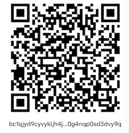

# ikea_stockcheck
Checks if Ikea items are in-stock for delivery only. Helpful for getting all the pieces needed for a kitchen!

## Step 0. (Optional) Set up your Telegram Bot 
This script includes the ability to send yourself a telegram message, using BotFather, when an item comes in stock.  
To setup your bot, first message `/start` to BotFather then `/newbot`. Follow the setup process then enter you information in the script:

```
def send_message(text):
    ## Enter you info here ##
    botfather_token = 'Numbers:Letters'
    user_id = @YourTelegramName # Can also use ID from userinfobot
    ## --- ##
    url = f'https://api.telegram.org/bot{botfather_token}/sendMessage'
    params = {
       "chat_id": user_id,
       "text": text}
```

If you don't want to message yourself, feel free to comment out the two `send_message` sections under `# Check if avilable for delivery

## Step 1. Set up your stocklist

Go to the ikea website and find your item(s). The URL should look like:   
`https://www.ikea.com/us/en/p/sektion-high-cabinet-frame-white-70265445/` 
The first part (eg 'sektion-high-cabinet-frame-white') is the name that will be the first item in your list. You can past it with or without the '-'.  
The numbers after that is the Article Number number. Fill it in second. You can either copy and paste it without the spaces.  
The last field is for notes. I put the dimensions in, but it could also be left as empty quotes.  
When you're done, your list should look like this:  

```
# ### USER INFO ###
# Items Still needed:
user_zipcode = 19146
item_list = [['sektion base cabinet frame white', '302 653 86', '30x24x30'],
             ['sektion wall top cabinet frame white', '202 655 13', '36x24x20'],
             ['sektion base cabinet frame white', '002 65 458', '18x14 3/4x40'],
             ['bodarp cover panel gray green', '604 355 99', '36x96']]
```

## Step 2. Enter your zipcode
Make sure to change `user_zipcode` to your own zipcode. If running locally, Ikea should be able to locate you. Just in case, fill this in. 

## Step 3. Setup Selenium
If you don't have the path set already for chromdriver, update `s=Service('yourpath')` to your path to chromedriver
```
# ### WEBSITE ###
# Set up Chromium:
s=Service('/Users/ambitiousdonut/chromedriver')
```


## Step 4. (Optional) Deploy for Regular Updates
Deploy to a service like [PythonAnywhere](https://www.pythonanywhere.com/?affiliate_id=0066b821) to check every day for stock updates. 


Find this helpful? Feel free to donate. Thanks!  

